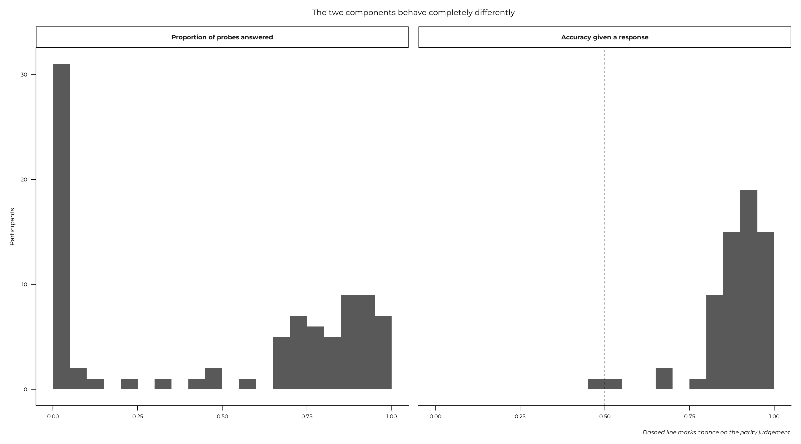
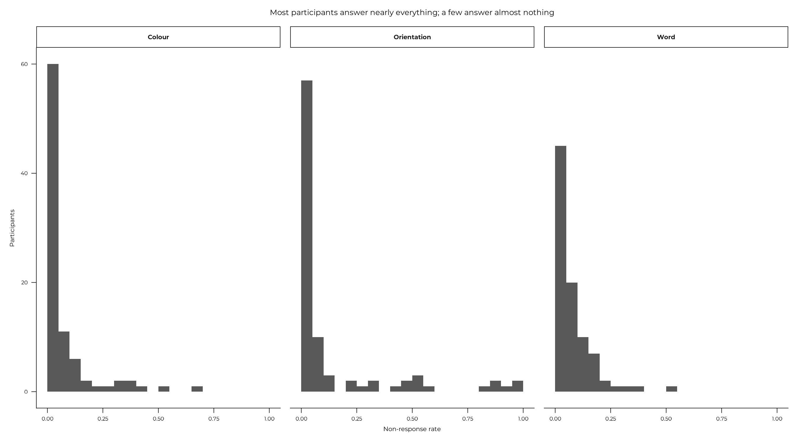

# Task engagement: two ways of not doing the task

Participants could decline to do the WM-FTT in two places: the
parity-judgement distractor between encoding and recall, and the recall
responses themselves. This page establishes what each of those variables
measures, shows that they are **separate behaviours**, and argues that
neither is a nuisance to be controlled away.

The second claim is the one the modelling pages depend on. Under a
points-per-feature incentive with optional recall, **declining to report
a feature is an allocation decision**, not missing data.

It is descriptive groundwork. The models that build on it live
elsewhere.

``` r

block_trials <- all_data |>
  dplyr::filter(grepl("^expe_block", expe_phase), version == "v1")

by_participant <- block_trials |>
  dplyr::summarise(
    # Parity is split into its two components. Section 2 shows why the
    # `parity_*_acc` columns cannot be used directly.
    parity_probes   = 2 * dplyr::n(),
    parity_answered = sum(responded_parity_1) + sum(responded_parity_2),
    parity_correct  = sum(parity_1_acc) + sum(parity_2_acc),
    non_response_word = 1 - mean(responded_word),
    non_response_orientation = 1 - mean(responded_angle),
    non_response_colour = 1 - mean(responded_color),
    vviq = dplyr::first(vviq_total_score),
    imagery_group = dplyr::first(vviq_group_2),
    .by = id
  ) |>
  dplyr::mutate(
    parity_rate = parity_answered / parity_probes,
    parity_accuracy_given_response =
      dplyr::if_else(parity_answered > 0, parity_correct / parity_answered,
                     NA_real_),
    # what a naive mean of `parity_*_acc` gives, kept for section 2
    parity_accuracy_naive = parity_correct / parity_probes
  )

# The per-feature recall engagement thresholds. A participant contributes
# to a feature only if the standard error of their mean is at most half
# the between-person SD; `wm_thresholds()` holds the resulting counts,
# hard-coded so they cannot drift with the sample. The task validity page
# derives them.
engaged <- engaged_ids(block_trials)
```

Two of those objects are used before the page that defines them, so they
are stated here rather than left implicit.
[`engaged_ids()`](https://m-delem.github.io/aphantasiaWMStrats/reference/engaged_ids.md)
keeps the participants who answered at least 32 word, 22 orientation and
29 colour items of the 63 presented. The [task
validity](https://m-delem.github.io/aphantasiaWMStrats/articles/task-validity.md)
page derives those numbers and explains what they are for; here they
serve only to separate *abandoning the distractor* from *abandoning the
task*.

## 1. The parity task had no consequence in v1

The scoring design was meant to make the distractor cost something: an
incorrect parity judgement deducts from the trial score. That penalty
was added in v2. **In v1 it is absent**, and since v1 is the primary
analysis sample, the distractor there was free.

``` r

block_trials |>
  dplyr::summarise(
    feature_scores_summed = sum(feedback_score_word) + sum(feedback_score_angle) +
      sum(feedback_score_color),
    trial_score_shown = dplyr::first(feedback_trial_score),
    .by = c(id, expe_phase, trial_number)
  ) |>
  dplyr::summarise(
    trials = dplyr::n(),
    trials_where_they_match = sum(abs(feature_scores_summed - trial_score_shown) < 1e-9)
  ) |>
  knitr::kable(caption = "v1: the trial score is exactly the sum of the three feature scores")
```

| trials | trials_where_they_match |
|-------:|------------------------:|
|   1848 |                    1848 |

v1: the trial score is exactly the sum of the three feature scores
{.table}

Every trial. No deduction was ever applied, so a participant who worked
out that parity did not count lost nothing by ignoring it.

Some of them worked it out.

``` r

optout <- dplyr::filter(by_participant, parity_rate == 0)

tibble::tibble(
  participants = nrow(by_participant),
  answered_no_parity_probe = nrow(optout),
  of_those_clearing_recall_thresholds = sum(optout$id %in% engaged)
) |>
  knitr::kable(caption = "Participants who ignored the distractor entirely, v1")
```

| participants | answered_no_parity_probe | of_those_clearing_recall_thresholds |
|-------------:|-------------------------:|------------------------------------:|
|           88 |                       25 |                                  23 |

Participants who ignored the distractor entirely, v1 {.table}

25 of 88 participants answered **no parity probe at all**, and 23 of
those clear the per-feature engagement thresholds on the recall task.
That is not withdrawal. Under v1’s incentives, abandoning a
consequence-free secondary task while keeping recall performance intact
is the rational move.

## 2. What the parity accuracy column actually measures

`parity_1_acc` and `parity_2_acc` score an **unanswered** probe as 0,
the same convention the recall scores use. That makes a zero ambiguous,
and in v1 the ambiguity is close to total.

``` r

tibble::tibble(
  zeros = sum(block_trials$parity_1_acc == 0),
  unanswered = sum(block_trials$parity_1_acc == 0 & !block_trials$responded_parity_1),
  answered_and_wrong = sum(block_trials$parity_1_acc == 0 & block_trials$responded_parity_1)
) |>
  knitr::kable(caption = "Zeros on parity_1_acc, v1: what they are")
```

| zeros | unanswered | answered_and_wrong |
|------:|-----------:|-------------------:|
|  3315 |       3046 |                269 |

Zeros on parity_1_acc, v1: what they are {.table}

Most of them are probes nobody answered. A participant mean of that
column is therefore not an accuracy measure. Split into its two
components, the two barely relate to each other:

``` r

components <- dplyr::filter(by_participant, !is.na(parity_accuracy_given_response))

tibble::tibble(
  quantity = c("Naive mean of parity_*_acc", "Proportion of probes answered",
               "Accuracy given a response"),
  median = c(stats::median(by_participant$parity_accuracy_naive),
             stats::median(by_participant$parity_rate),
             stats::median(components$parity_accuracy_given_response)),
  at_exactly_zero = c(sum(by_participant$parity_accuracy_naive == 0),
                      sum(by_participant$parity_rate == 0), 0L)
) |>
  knitr::kable(digits = 3, caption = "Three quantities, v1")
```

| quantity                      | median | at_exactly_zero |
|:------------------------------|-------:|----------------:|
| Naive mean of parity\_\*\_acc |  0.591 |              25 |
| Proportion of probes answered |  0.694 |              25 |
| Accuracy given a response     |  0.908 |               0 |

Three quantities, v1 {.table}

``` r


tibble::tibble(
  pair = c("Naive mean vs proportion answered",
           "Naive mean vs accuracy given a response",
           "Proportion answered vs accuracy given a response"),
  r = c(stats::cor(by_participant$parity_accuracy_naive, by_participant$parity_rate),
        stats::cor(components$parity_accuracy_naive,
                   components$parity_accuracy_given_response),
        stats::cor(components$parity_rate,
                   components$parity_accuracy_given_response))
) |>
  knitr::kable(digits = 3, caption = "What the naive column is made of")
```

| pair                                             |     r |
|:-------------------------------------------------|------:|
| Naive mean vs proportion answered                | 0.989 |
| Naive mean vs accuracy given a response          | 0.215 |
| Proportion answered vs accuracy given a response | 0.043 |

What the naive column is made of {.table}

The naive column is almost perfectly correlated with the proportion of
probes answered, and weakly with accuracy among those answered. It is a
response-rate variable wearing an accuracy name, and that is the whole
explanation for its bimodality. Meanwhile the two real components are
close to orthogonal, so collapsing them does not blur two related
quantities: it discards one.

``` r

by_participant |>
  dplyr::select(id, parity_rate, parity_accuracy_given_response) |>
  tidyr::pivot_longer(-id, names_to = "quantity", values_to = "value") |>
  dplyr::mutate(quantity = factor(
    dplyr::recode(quantity,
      parity_rate = "Proportion of probes answered",
      parity_accuracy_given_response = "Accuracy given a response"),
    # narrative order, not alphabetical
    levels = c("Proportion of probes answered", "Accuracy given a response")
  )) |>
  ggplot(aes(value)) +
  geom_histogram(binwidth = 0.05, boundary = 0) +
  # chance is only a reference point for the accuracy panel; drawing it on
  # a response rate would imply something it does not mean
  geom_vline(
    data = tibble::tibble(quantity = factor("Accuracy given a response",
      levels = c("Proportion of probes answered", "Accuracy given a response"))),
    aes(xintercept = 0.5), linetype = "dashed"
  ) +
  facet_wrap(~quantity) +
  labs(x = NULL, y = "Participants",
       title = "The two components behave completely differently",
       caption = "Dashed line marks chance on the parity judgement.")
```



Whether someone did the distractor is bimodal, with a hard spike at
zero. How well they did it, among those who did, is unimodal and well
above the chance line. Only the second is an accuracy variable.

### The claim this section used to make

An earlier version of this page reported a correlation between the naive
column and VVIQ and concluded that it was “the finding that stops parity
accuracy being usable as a nuisance covariate”. Both halves of that were
too strong.

``` r

usable <- dplyr::filter(by_participant, !is.na(vviq))

naive_vviq <- correlation_test(usable$parity_accuracy_naive, usable$vviq)

dplyr::bind_rows(
  dplyr::mutate(naive_vviq, quantity = "Naive mean of parity_*_acc"),
  dplyr::mutate(correlation_test(usable$parity_rate, usable$vviq),
                quantity = "Proportion of probes answered"),
  dplyr::mutate(
    correlation_test(usable$parity_accuracy_given_response, usable$vviq),
    quantity = "Accuracy given a response")
) |>
  dplyr::select(quantity, n, rho, p) |>
  knitr::kable(digits = 4, caption = "Parity against VVIQ, v1")
```

| quantity                      |   n |     rho |      p |
|:------------------------------|----:|--------:|-------:|
| Naive mean of parity\_\*\_acc |  86 | -0.1540 | 0.1569 |
| Proportion of probes answered |  86 | -0.1288 | 0.2374 |
| Accuracy given a response     |  62 | -0.1236 | 0.3384 |

Parity against VVIQ, v1 {.table}

The original figure was rho = -0.154 with p = 0.157, which is not
evidence for a direction, and it came from a variable that measures
willingness rather than accuracy. Neither corrected component does any
better. **Parity engagement is not related to imagery vividness in this
sample.**

## 3. The second signal: declining to report a feature

Between 6.7% and 13.6% of v1 recall items receive no response at all.
The task encodes these with sentinels rather than missing values, and
the
[Scoring](https://m-delem.github.io/aphantasiaWMStrats/articles/scoring.md)
page covers how they are handled.

``` r

by_participant |>
  tidyr::pivot_longer(tidyselect::starts_with("non_response_"),
                      names_to = "feature", values_to = "rate",
                      names_prefix = "non_response_") |>
  dplyr::mutate(feature = stringr::str_to_title(feature)) |>
  ggplot(aes(rate)) +
  geom_histogram(binwidth = 0.05, boundary = 0) +
  facet_wrap(~feature) +
  labs(x = "Non-response rate", y = "Participants",
       title = "Most participants answer nearly everything; a few answer almost nothing")
```



## 4. The two are not the same behaviour

The natural assumption is that both are effort withdrawal, in which case
one variable would do. They are not.

``` r

by_participant |>
  tidyr::pivot_longer(tidyselect::starts_with("non_response_"),
                      names_to = "feature", values_to = "non_response",
                      names_prefix = "non_response_") |>
  dplyr::summarise(
    rho = stats::cor(non_response, parity_rate, method = "spearman"),
    p = suppressWarnings(stats::cor.test(non_response, parity_rate,
                                         method = "spearman")$p.value),
    .by = feature
  ) |>
  dplyr::mutate(feature = stringr::str_to_title(feature)) |>
  knitr::kable(digits = 3,
               caption = "Feature non-response against parity engagement, v1")
```

| feature     |    rho |     p |
|:------------|-------:|------:|
| Word        |  0.112 | 0.300 |
| Orientation | -0.077 | 0.477 |
| Colour      | -0.082 | 0.447 |

Feature non-response against parity engagement, v1 {.table}

The correlations are near zero and inconsistent in sign. Ignoring the
distractor tells you essentially nothing about whether someone will
answer a recall prompt, which is what a shared-disengagement account
would need. **Two behaviours, not one.**

That has a practical consequence. A single “engagement” covariate would
average two unrelated things and control for neither.

## 5. What this means downstream

**Parity engagement is not a confound.** It does not differ by imagery
group:

``` r

floor_split <- by_participant |>
  dplyr::filter(!is.na(vviq), id %in% engaged) |>
  dplyr::mutate(floor = dplyr::if_else(vviq == 16, "VVIQ floor", "Above floor"))

floor_split |>
  dplyr::summarise(
    participants = dplyr::n(),
    mean_parity_rate = mean(parity_rate),
    .by = floor
  ) |>
  knitr::kable(digits = 3,
               caption = "Parity engagement by imagery group, engaged sample")
```

| floor       | participants | mean_parity_rate |
|:------------|-------------:|-----------------:|
| VVIQ floor  |           18 |            0.505 |
| Above floor |           61 |            0.495 |

Parity engagement by imagery group, engaged sample {.table}

``` r

stats::wilcox.test(parity_rate ~ floor, data = floor_split, exact = FALSE)
#> 
#>  Wilcoxon rank sum test with continuity correction
#> 
#> data:  parity_rate by floor
#> W = 540.5, p-value = 0.9247
#> alternative hypothesis: true location shift is not equal to 0
```

It is still worth carrying in the accuracy models, but as the
**dual-task load a participant actually incurred**, which is a strategy
variable in its own right, rather than as a control for something it
does not predict. Every accuracy model on this site carries it, and no
gate does: the
[composition](https://m-delem.github.io/aphantasiaWMStrats/articles/composition.md),
[performance](https://m-delem.github.io/aphantasiaWMStrats/articles/performance.md)
and [joint
model](https://m-delem.github.io/aphantasiaWMStrats/articles/joint-model.md)
pages all put `parity_rate` on the arms that model how well a feature
was recalled, and leave it off the arms that model whether it was
recalled at all.

**Non-response is the substantive one.** It is folded into the recall
scores as zeros, so any analysis of accuracy that ignores the
`responded_*` flags is measuring a blend of accuracy and willingness to
answer. The
[Scoring](https://m-delem.github.io/aphantasiaWMStrats/articles/scoring.md)
page quantifies how much difference that makes.

More than that: under a points-per-feature incentive with optional
recall, choosing not to report a feature **is** an allocation decision,
and arguably a more direct one than how accurately a reported feature
was recalled. Treating it as missing data discards the clearest
strategic signal the task produces. That is why the [joint
model](https://m-delem.github.io/aphantasiaWMStrats/articles/joint-model.md)
fits whether a feature was reported and how well it was reported
together, rather than conditioning on the first and analysing only the
second.

------------------------------------------------------------------------

**Continuing through the Extended Online Report:** this page follows
[scoring](https://m-delem.github.io/aphantasiaWMStrats/articles/scoring.md).
To keep reading in order, continue to
[versions](https://m-delem.github.io/aphantasiaWMStrats/articles/version-scope.md)
next. Or skip ahead to [the
analysis](https://m-delem.github.io/aphantasiaWMStrats/articles/analysis-strategy.md),
which explains what the modelling pages do and why.

------------------------------------------------------------------------

    #> ─ Session info ───────────────────────────────────────────────────────────────
    #>  setting  value
    #>  version  R version 4.6.1 (2026-06-24)
    #>  os       Ubuntu 24.04.4 LTS
    #>  system   x86_64, linux-gnu
    #>  ui       X11
    #>  language en
    #>  collate  C.UTF-8
    #>  ctype    C.UTF-8
    #>  tz       UTC
    #>  date     2026-08-26
    #>  pandoc   3.8.3 @ /opt/hostedtoolcache/pandoc/3.8.3/x64/ (via rmarkdown)
    #>  quarto   NA
    #> 
    #> ─ Packages ───────────────────────────────────────────────────────────────────
    #>  package            * version date (UTC) lib source
    #>  aphantasiaWMStrats * 0.1     2026-08-26 [1] local
    #>  bslib                0.12.0  2026-08-04 [2] CRAN (R 4.6.1)
    #>  cachem               1.1.0   2024-05-16 [2] CRAN (R 4.6.1)
    #>  cli                  3.6.6   2026-04-09 [2] CRAN (R 4.6.1)
    #>  crayon               1.5.3   2024-06-20 [2] CRAN (R 4.6.1)
    #>  curl                 8.0.0   2026-08-25 [2] CRAN (R 4.6.1)
    #>  desc                 1.4.3   2023-12-10 [2] CRAN (R 4.6.1)
    #>  digest               0.6.39  2025-11-19 [2] CRAN (R 4.6.1)
    #>  dplyr                1.2.1   2026-04-03 [2] CRAN (R 4.6.1)
    #>  evaluate             1.0.5   2025-08-27 [2] CRAN (R 4.6.1)
    #>  farver               2.1.2   2024-05-13 [2] CRAN (R 4.6.1)
    #>  fastmap              1.2.0   2024-05-15 [2] CRAN (R 4.6.1)
    #>  fs                   2.1.0   2026-04-18 [2] CRAN (R 4.6.1)
    #>  generics             0.1.4   2025-05-09 [2] CRAN (R 4.6.1)
    #>  ggplot2            * 4.0.3   2026-04-22 [2] CRAN (R 4.6.1)
    #>  glue                 1.8.1   2026-04-17 [2] CRAN (R 4.6.1)
    #>  gtable               0.3.6   2024-10-25 [2] CRAN (R 4.6.1)
    #>  htmltools            0.5.9   2025-12-04 [2] CRAN (R 4.6.1)
    #>  jquerylib            0.1.4   2021-04-26 [2] CRAN (R 4.6.1)
    #>  jsonlite             2.0.0   2025-03-27 [2] CRAN (R 4.6.1)
    #>  knitr                1.51    2025-12-20 [2] CRAN (R 4.6.1)
    #>  labeling             0.4.3   2023-08-29 [2] CRAN (R 4.6.1)
    #>  lifecycle            1.0.5   2026-01-08 [2] CRAN (R 4.6.1)
    #>  magrittr             2.0.5   2026-04-04 [2] CRAN (R 4.6.1)
    #>  otel                 0.2.0   2025-08-29 [2] CRAN (R 4.6.1)
    #>  pillar               1.11.1  2025-09-17 [2] CRAN (R 4.6.1)
    #>  pkgconfig            2.0.3   2019-09-22 [2] CRAN (R 4.6.1)
    #>  pkgdown              2.2.1   2026-07-07 [2] any (@2.2.1)
    #>  purrr                1.2.2   2026-04-10 [2] CRAN (R 4.6.1)
    #>  R6                   2.6.1   2025-02-15 [2] CRAN (R 4.6.1)
    #>  ragg                 1.5.2   2026-03-23 [2] CRAN (R 4.6.1)
    #>  RColorBrewer         1.1-3   2022-04-03 [2] CRAN (R 4.6.1)
    #>  renv                 1.0.7   2024-04-11 [2] RSPM (R 4.6.1)
    #>  rlang                1.3.0   2026-07-05 [2] CRAN (R 4.6.1)
    #>  rmarkdown            2.31    2026-03-26 [2] CRAN (R 4.6.1)
    #>  S7                   0.2.2   2026-04-22 [2] CRAN (R 4.6.1)
    #>  sass                 0.4.10  2025-04-11 [2] CRAN (R 4.6.1)
    #>  scales               1.4.0   2025-04-24 [2] CRAN (R 4.6.1)
    #>  sessioninfo          1.2.4   2026-06-04 [2] CRAN (R 4.6.1)
    #>  showtext             0.9-8   2026-03-21 [2] CRAN (R 4.6.1)
    #>  showtextdb           3.0     2020-06-04 [2] CRAN (R 4.6.1)
    #>  stringi              1.8.9   2026-08-04 [2] CRAN (R 4.6.1)
    #>  stringr              1.6.0   2025-11-04 [2] CRAN (R 4.6.1)
    #>  sysfonts             0.8.9   2024-03-02 [2] CRAN (R 4.6.1)
    #>  systemfonts          1.3.2   2026-03-05 [2] CRAN (R 4.6.1)
    #>  textshaping          1.0.5   2026-03-06 [2] CRAN (R 4.6.1)
    #>  tibble               3.3.1   2026-01-11 [2] CRAN (R 4.6.1)
    #>  tidyr                1.3.2   2025-12-19 [2] CRAN (R 4.6.1)
    #>  tidyselect           1.2.1   2024-03-11 [2] CRAN (R 4.6.1)
    #>  vctrs                0.7.3   2026-04-11 [2] CRAN (R 4.6.1)
    #>  withr                3.0.3   2026-06-19 [2] CRAN (R 4.6.1)
    #>  xfun                 0.60    2026-07-09 [2] CRAN (R 4.6.1)
    #>  yaml                 2.3.12  2025-12-10 [2] CRAN (R 4.6.1)
    #> 
    #>  [1] /tmp/Rtmph67Pun/temp_libpath87a93012435a
    #>  [2] /home/runner/.cache/R/renv/library/aphantasiaWMStrats-f7ce8556/linux-ubuntu-noble/R-4.6/x86_64-pc-linux-gnu
    #>  [3] /home/runner/.cache/R/renv/sandbox/linux-ubuntu-noble/R-4.6/x86_64-pc-linux-gnu/e7c0fad7
    #>  * ── Packages attached to the search path.
    #> 
    #> ──────────────────────────────────────────────────────────────────────────────
