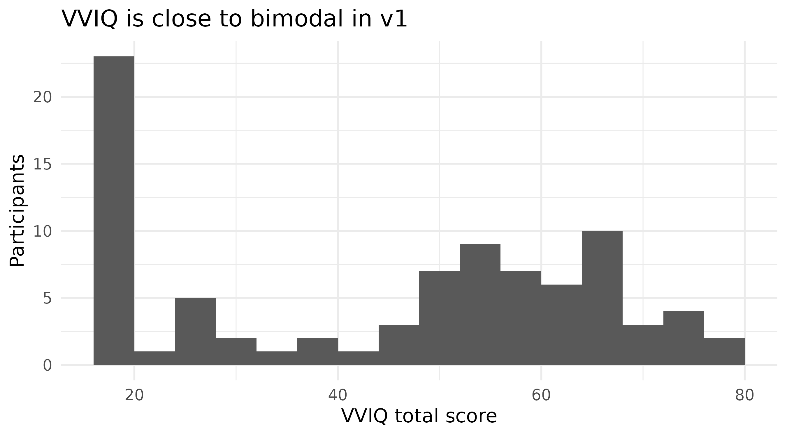

# Psychometrics: how the questionnaires behave in this sample

Three questionnaires accompany the WM-FTT: the VVIQ (Marks, 1973), the
OSIVQ (Blazhenkova & Kozhevnikov, 2009) and the NIEQ (Heavey et al.,
2019). All three feed downstream analyses, and two of them turned out to
need caveats. This page reports how each behaves in this sample.

The task’s own reliabilities are on the [task
validity](https://m-delem.github.io/aphantasiaWMStrats/articles/task-validity.md)
page, where the split-half machinery lives. Everything below is computed
when this page is built.

**This page stays on v1**, where the [beyond
vividness](https://m-delem.github.io/aphantasiaWMStrats/articles/beyond-vividness.md)
page pools all three versions. The two are asking different questions.
Pooling is right when the aim is to describe the instruments in as many
people as possible; here the aim is to say whether the scales are
trustworthy *in the sample the modelling pages use*, and that sample is
v1. Where a claim below rests on the other versions, it says so.

``` r

participants <- get_data("v1") |> dplyr::distinct(id, .keep_all = TRUE)

# Cronbach's alpha from raw items. Written out rather than pulled from a
# package so the formula is visible: k/(k-1) * (1 - sum(item variances) /
# variance of the total).
cronbach_alpha <- function(items) {
  items <- items[stats::complete.cases(items), , drop = FALSE]
  n_items <- ncol(items)
  n_items / (n_items - 1) *
    (1 - sum(apply(items, 2, stats::var)) / stats::var(rowSums(items)))
}

# Corrected item-total correlation: each item against the sum of the others.
item_total <- function(items) {
  items <- items[stats::complete.cases(items), , drop = FALSE]
  total <- rowSums(items)
  purrr::map_dbl(names(items), \(item) stats::cor(items[[item]], total - items[[item]]))
}
```

## 1. VVIQ

Sixteen items, no reverse-keyed items, single dimension.

``` r

vviq_items <- purrr::list_rbind(participants$vviq_items)

tibble::tibble(
  instrument = "VVIQ",
  items = ncol(vviq_items),
  alpha = cronbach_alpha(vviq_items),
  min_item_total = min(item_total(vviq_items)),
  negative_item_totals = sum(item_total(vviq_items) < 0)
) |>
  knitr::kable(digits = 3, caption = "VVIQ internal consistency, v1")
```

| instrument | items | alpha | min_item_total | negative_item_totals |
|:-----------|------:|------:|---------------:|---------------------:|
| VVIQ       |    16 | 0.978 |          0.774 |                    0 |

VVIQ internal consistency, v1 {.table}

Nothing to report, which is the useful result: alpha is high, every item
correlates positively with the rest, and the weakest item still exceeds
0.75. The VVIQ is doing its job here.

The distribution is another matter, and matters more for modelling than
the reliability does:

``` r

participants |>
  dplyr::filter(!is.na(vviq_total_score)) |>
  ggplot(aes(vviq_total_score)) +
  geom_histogram(binwidth = 4, boundary = 16) +
  labs(x = "VVIQ total score", y = "Participants",
       title = "VVIQ is close to bimodal in v1")
```



``` r

participants |>
  dplyr::filter(!is.na(vviq_total_score)) |>
  dplyr::count(band = cut(vviq_total_score, c(15, 16, 25, 40, 60, 80),
                          include.lowest = TRUE)) |>
  knitr::kable(caption = "VVIQ distribution: a floor spike and a sparse middle")
```

| band      |   n |
|:----------|----:|
| \[15,16\] |  20 |
| (16,25\]  |   7 |
| (25,40\]  |   7 |
| (40,60\]  |  27 |
| (60,80\]  |  25 |

VVIQ distribution: a floor spike and a sparse middle {.table}

Roughly a quarter of the sample sits at exactly 16, the scale minimum,
and the middle of the range is sparsely populated. That is why VVIQ is
not treated as a plain continuous predictor everywhere downstream; [the
analysis
strategy](https://m-delem.github.io/aphantasiaWMStrats/articles/analysis-strategy.md)
page §3 sets out the floor-group form every model uses and the caution
that comes with it.

## 2. OSIVQ

Three subscales: object, spatial, verbal. **Four items are
reverse-keyed, and they are stored inconsistently across task
versions.** v1 and v2 store `osivq_q02v`, `osivq_q09v`, `osivq_q41v` and
`osivq_q42s` un-reversed; v3 stores them already reversed. The
`object_mean`, `spatial_mean` and `verbal_mean` columns are correct in
both cases. Only the raw items in `osivq_items` differ.

That claim spans versions while the rest of this page is v1, so it is
checked directly rather than asserted: if v3 really does store them
reversed, its item-total correlations for those items should be
**positive** where v1’s are negative.

``` r

reverse_keyed <- c("osivq_q02v", "osivq_q09v", "osivq_q41v", "osivq_q42s")

item_total_by_version <- function(v) {
  people <- get_data(v) |> dplyr::distinct(id, .keep_all = TRUE)
  items <- purrr::list_rbind(people$osivq_items)
  suffix <- sub("^.*q[0-9]+", "", reverse_keyed)
  purrr::map2_dbl(reverse_keyed, suffix, function(item, s) {
    block <- items[, grepl(paste0(s, "$"), names(items)), drop = FALSE]
    block <- block[stats::complete.cases(block), , drop = FALSE]
    stats::cor(block[[item]], rowSums(block) - block[[item]])
  })
}

tibble::tibble(item = reverse_keyed) |>
  dplyr::mutate(
    v1 = item_total_by_version("v1"),
    v3 = item_total_by_version("v3")
  ) |>
  knitr::kable(digits = 2,
               caption = "Corrected item-total correlations for the four reverse-keyed items")
```

| item       |    v1 |   v3 |
|:-----------|------:|-----:|
| osivq_q02v | -0.27 | 0.51 |
| osivq_q09v | -0.29 | 0.58 |
| osivq_q41v | -0.32 | 0.56 |
| osivq_q42s | -0.50 | 0.46 |

Corrected item-total correlations for the four reverse-keyed items
{.table}

Negative in v1, positive in v3. The items are the same; only the storage
convention differs.

The consequence within v1:

``` r

osivq_raw <- purrr::list_rbind(participants$osivq_items)
osivq_fixed <- osivq_raw
for (item in reverse_keyed) osivq_fixed[[item]] <- 6 - osivq_fixed[[item]]

subscale_items <- function(items, suffix) {
  items[, grepl(paste0(suffix, "$"), names(items)), drop = FALSE]
}

tibble::tibble(
  subscale = c("object", "spatial", "verbal"),
  suffix = c("o", "s", "v")
) |>
  dplyr::mutate(
    items = purrr::map_int(suffix, \(s) ncol(subscale_items(osivq_raw, s))),
    alpha_as_stored = purrr::map_dbl(suffix, \(s) cronbach_alpha(subscale_items(osivq_raw, s))),
    alpha_corrected = purrr::map_dbl(suffix, \(s) cronbach_alpha(subscale_items(osivq_fixed, s)))
  ) |>
  dplyr::select(-suffix) |>
  knitr::kable(digits = 3,
               caption = "OSIVQ alpha in v1, before and after reversing the reverse-keyed items")
```

| subscale | items | alpha_as_stored | alpha_corrected |
|:---------|------:|----------------:|----------------:|
| object   |    14 |           0.951 |           0.951 |
| spatial  |    11 |           0.758 |           0.861 |
| verbal   |     9 |           0.249 |           0.842 |

OSIVQ alpha in v1, before and after reversing the reverse-keyed items
{.table}

Computed naively from the stored items, the verbal subscale looks
broken. Corrected, all three are healthy. The three items driving it are
visible in their item-total correlations:

``` r

verbal_raw <- subscale_items(osivq_raw, "v")
tibble::tibble(item = names(verbal_raw),
               item_total_as_stored = item_total(verbal_raw)) |>
  dplyr::arrange(item_total_as_stored) |>
  knitr::kable(digits = 2,
               caption = "OSIVQ verbal items: negative correlations mark the unreversed ones")
```

| item       | item_total_as_stored |
|:-----------|---------------------:|
| osivq_q41v |                -0.32 |
| osivq_q09v |                -0.29 |
| osivq_q02v |                -0.27 |
| osivq_q08v |                 0.26 |
| osivq_q35v |                 0.26 |
| osivq_q04v |                 0.26 |
| osivq_q37v |                 0.37 |
| osivq_q16v |                 0.45 |
| osivq_q39v |                 0.47 |

OSIVQ verbal items: negative correlations mark the unreversed ones
{.table}

Anyone recomputing OSIVQ scores from the item columns needs to reverse
those four for v1 and v2, and not for v3. The subscale mean columns
already handle it.

## 3. NIEQ

Ten items: five dimensions, each measured by a “frequently” item and a
“generally” item, scored as the pair’s mean.

**A total across all ten items is meaningless**, since the dimensions
are different constructs, not facets of a single construct. Someone with
frequent inner speech need not have frequent imagery. So Cronbach’s
alpha over the full instrument is not the right statistic, and computing
it would produce a number that looks like a defect but is not one. The
right check is whether each pair agrees.

``` r

nieq_items <- purrr::list_rbind(participants$nieq_items)

# Two-item reliability is the Spearman-Brown correction of the pair's
# correlation, not alpha. Written out for the same reason as
# `cronbach_alpha()` above: this page's job is to show the arithmetic, so
# both formulas are visible rather than called from the package. The
# exported `spearman_brown()` is identical and is what the scripts use.
spearman_brown <- function(r) 2 * r / (1 + r)

nieq_pairs <- tibble::tibble(
  dimension = c("Mental imagery", "Inner voice", "Emotions",
                "Sensory focus", "Unsymbolised thinking"),
  stem = c("mental_imagery", "inner_voice", "emotions",
           "sensory_focus", "unsymbolised")
) |>
  dplyr::mutate(
    pair_r = purrr::map_dbl(stem, \(s) stats::cor(
      nieq_items[[paste0("nieq_freq_", s)]],
      nieq_items[[paste0("nieq_prop_", s)]],
      use = "complete.obs")),
    reliability = spearman_brown(pair_r)
  ) |>
  dplyr::select(-stem)

knitr::kable(nieq_pairs, digits = 3,
             caption = "NIEQ two-item subscale reliability, v1")
```

| dimension             | pair_r | reliability |
|:----------------------|-------:|------------:|
| Mental imagery        |  0.838 |       0.912 |
| Inner voice           |  0.763 |       0.865 |
| Emotions              |  0.665 |       0.799 |
| Sensory focus         |  0.326 |       0.492 |
| Unsymbolised thinking |  0.575 |       0.730 |

NIEQ two-item subscale reliability, v1 {.table}

Four of the five dimensions are adequate. **Sensory focus is not**, at
0.49, well below the conventional 0.70 floor: its two items barely
agree, so the subscale mean is not measuring one thing. That is
consistent with sensory awareness being the weakest dimension in the
instrument’s own validation, and it means sensory focus should not carry
the same weight as the others wherever NIEQ subscales are used as
inputs.

Unsymbolised thinking, at 0.73, is adequate. It is the dimension with
the clearest theoretical stake in this project, so it is important to
assess whether it can legitimately support the weight placed on it.

## 4. Summary

``` r

dplyr::bind_rows(
  tibble::tibble(instrument = "VVIQ", scale = "total",
                 reliability = cronbach_alpha(vviq_items), method = "alpha, 16 items"),
  tibble::tibble(
    instrument = "OSIVQ",
    scale = c("object", "spatial", "verbal"),
    reliability = purrr::map_dbl(c("o", "s", "v"),
                                 \(s) cronbach_alpha(subscale_items(osivq_fixed, s))),
    method = "alpha, reverse-keyed items corrected"),
  nieq_pairs |>
    dplyr::transmute(instrument = "NIEQ", scale = dimension,
                     reliability, method = "Spearman-Brown, 2 items")
) |>
  dplyr::mutate(adequate = dplyr::if_else(reliability >= 0.70, "yes", "NO")) |>
  knitr::kable(digits = 3, caption = "All questionnaire scales, v1")
```

| instrument | scale | reliability | method | adequate |
|:---|:---|---:|:---|:---|
| VVIQ | total | 0.978 | alpha, 16 items | yes |
| OSIVQ | object | 0.951 | alpha, reverse-keyed items corrected | yes |
| OSIVQ | spatial | 0.861 | alpha, reverse-keyed items corrected | yes |
| OSIVQ | verbal | 0.842 | alpha, reverse-keyed items corrected | yes |
| NIEQ | Mental imagery | 0.912 | Spearman-Brown, 2 items | yes |
| NIEQ | Inner voice | 0.865 | Spearman-Brown, 2 items | yes |
| NIEQ | Emotions | 0.799 | Spearman-Brown, 2 items | yes |
| NIEQ | Sensory focus | 0.492 | Spearman-Brown, 2 items | NO |
| NIEQ | Unsymbolised thinking | 0.730 | Spearman-Brown, 2 items | yes |

All questionnaire scales, v1 {.table}

One scale of nine falls below the threshold. Whether the others enter
the models and how was decided based on our hypotheses on each scale,
which is detailed further in the
[composition](https://m-delem.github.io/aphantasiaWMStrats/articles/composition.md)
analyses page.

------------------------------------------------------------------------

**Continuing through the Extended Online Report:** this page follows
[task
validity](https://m-delem.github.io/aphantasiaWMStrats/articles/task-validity.md).
To keep reading in order, continue to [the
analysis](https://m-delem.github.io/aphantasiaWMStrats/articles/analysis-strategy.md)
next, which lays out the bases of all further analyses in this project.

------------------------------------------------------------------------

## References

Blazhenkova, O., & Kozhevnikov, M. (2009). The new object-spatial-verbal
cognitive style model: Theory and measurement. *Applied Cognitive
Psychology*, *23*(5), 638–663. <https://doi.org/10.1002/acp.1473>

Heavey, C. L., Moynihan, S. A., Brouwers, V. P., Lapping-Carr, L.,
Krumm, A. E., Kelsey, J. M., Turner, D. K., & Hurlburt, R. T. (2019).
Measuring the frequency of inner-experience characteristics by
self-report: The nevada inner experience questionnaire. *Frontiers in
Psychology*, *9*, 2615. <https://doi.org/10.3389/fpsyg.2018.02615>

Marks, D. F. (1973). Visual imagery differences in the recall of
pictures. *British Journal of Psychology*, *64*(1), 17–24.
<https://doi.org/10.1111/j.2044-8295.1973.tb01322.x>

    #> ─ Session info ───────────────────────────────────────────────────────────────
    #>  setting  value
    #>  version  R version 4.6.1 (2026-06-24)
    #>  os       Ubuntu 22.04.5 LTS
    #>  system   x86_64, linux-gnu
    #>  ui       X11
    #>  language en
    #>  collate  C.UTF-8
    #>  ctype    C.UTF-8
    #>  tz       UTC
    #>  date     2026-08-31
    #>  pandoc   3.8.3 @ /opt/hostedtoolcache/pandoc/3.8.3/x64/ (via rmarkdown)
    #>  quarto   NA
    #> 
    #> ─ Packages ───────────────────────────────────────────────────────────────────
    #>  package            * version date (UTC) lib source
    #>  aphantasiaWMStrats * 0.1     2026-08-31 [1] local
    #>  bslib                0.12.0  2026-08-04 [2] CRAN (R 4.6.1)
    #>  cachem               1.1.0   2024-05-16 [2] CRAN (R 4.6.1)
    #>  cli                  3.6.6   2026-04-09 [2] CRAN (R 4.6.1)
    #>  crayon               1.5.3   2024-06-20 [2] CRAN (R 4.6.1)
    #>  desc                 1.4.3   2023-12-10 [2] CRAN (R 4.6.1)
    #>  digest               0.6.39  2025-11-19 [2] CRAN (R 4.6.1)
    #>  dplyr                1.2.1   2026-04-03 [2] CRAN (R 4.6.1)
    #>  evaluate             1.0.5   2025-08-27 [2] CRAN (R 4.6.1)
    #>  farver               2.1.2   2024-05-13 [2] CRAN (R 4.6.1)
    #>  fastmap              1.2.0   2024-05-15 [2] CRAN (R 4.6.1)
    #>  fs                   2.1.0   2026-04-18 [2] CRAN (R 4.6.1)
    #>  generics             0.1.4   2025-05-09 [2] CRAN (R 4.6.1)
    #>  ggplot2            * 4.0.3   2026-04-22 [2] CRAN (R 4.6.1)
    #>  glue                 1.8.1   2026-04-17 [2] CRAN (R 4.6.1)
    #>  gtable               0.3.6   2024-10-25 [2] CRAN (R 4.6.1)
    #>  htmltools            0.5.9   2025-12-04 [2] CRAN (R 4.6.1)
    #>  jquerylib            0.1.4   2021-04-26 [2] CRAN (R 4.6.1)
    #>  jsonlite             2.0.0   2025-03-27 [2] CRAN (R 4.6.1)
    #>  knitr                1.51    2025-12-20 [2] CRAN (R 4.6.1)
    #>  labeling             0.4.3   2023-08-29 [2] CRAN (R 4.6.1)
    #>  lifecycle            1.0.5   2026-01-08 [2] CRAN (R 4.6.1)
    #>  magrittr             2.0.5   2026-04-04 [2] CRAN (R 4.6.1)
    #>  otel                 0.2.0   2025-08-29 [2] CRAN (R 4.6.1)
    #>  pillar               1.11.1  2025-09-17 [2] CRAN (R 4.6.1)
    #>  pkgconfig            2.0.3   2019-09-22 [2] CRAN (R 4.6.1)
    #>  pkgdown              2.2.1   2026-07-07 [2] any (@2.2.1)
    #>  purrr                1.2.2   2026-04-10 [2] CRAN (R 4.6.1)
    #>  R6                   2.6.1   2025-02-15 [2] CRAN (R 4.6.1)
    #>  ragg                 1.5.2   2026-03-23 [2] CRAN (R 4.6.1)
    #>  RColorBrewer         1.1-3   2022-04-03 [2] CRAN (R 4.6.1)
    #>  renv                 1.0.7   2024-04-11 [2] RSPM (R 4.6.1)
    #>  rlang                1.3.0   2026-07-05 [2] CRAN (R 4.6.1)
    #>  rmarkdown            2.31    2026-03-26 [2] CRAN (R 4.6.1)
    #>  S7                   0.2.2   2026-04-22 [2] CRAN (R 4.6.1)
    #>  sass                 0.4.10  2025-04-11 [2] CRAN (R 4.6.1)
    #>  scales               1.4.0   2025-04-24 [2] CRAN (R 4.6.1)
    #>  sessioninfo          1.2.4   2026-06-04 [2] CRAN (R 4.6.1)
    #>  systemfonts          1.3.2   2026-03-05 [2] CRAN (R 4.6.1)
    #>  textshaping          1.0.5   2026-03-06 [2] CRAN (R 4.6.1)
    #>  tibble               3.3.1   2026-01-11 [2] CRAN (R 4.6.1)
    #>  tidyselect           1.2.1   2024-03-11 [2] CRAN (R 4.6.1)
    #>  vctrs                0.7.3   2026-04-11 [2] CRAN (R 4.6.1)
    #>  withr                3.0.3   2026-06-19 [2] CRAN (R 4.6.1)
    #>  xfun                 0.60    2026-07-09 [2] CRAN (R 4.6.1)
    #>  yaml                 2.3.12  2025-12-10 [2] CRAN (R 4.6.1)
    #> 
    #>  [1] /tmp/RtmpjrXxde/temp_libpath83d0647deac5
    #>  [2] /home/runner/.cache/R/renv/library/aphantasiaWMStrats-f7ce8556/linux-ubuntu-jammy/R-4.6/x86_64-pc-linux-gnu
    #>  [3] /home/runner/.cache/R/renv/sandbox/linux-ubuntu-jammy/R-4.6/x86_64-pc-linux-gnu/e7c0fad7
    #>  * ── Packages attached to the search path.
    #> 
    #> ──────────────────────────────────────────────────────────────────────────────
