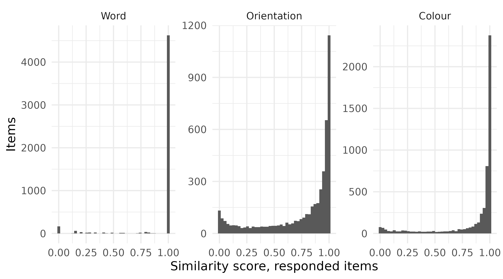

# Scoring the WM-FTT: what the numbers are, and what they support

The Working Memory Feature Trade-off Task asks participants to hold
three features of each stimulus (a word, the orientation of the
rectangle containing it, and its colour) and to report all three at
recall. Scoring it is less obvious than it looks. This page documents
how the scores in `all_data` are computed, what the distributions look
like, how reliable they are, and which claims they will and will not
support.

Every number below is computed from `all_data` when this page is built,
not transcribed from an analysis run elsewhere.

## The data this page works from

`all_data` is stimulus-level: one row per presented stimulus, with all
three recalled features side by side in separate columns. Almost every
question below is about *features*, so the first step is to reshape to
one row per stimulus per feature. Three frames are built once here and
reused throughout.

``` r

# 1. Experimental-block rows only. Tutorial rows carry placeholder values,
#    and training rows precede the blocks by design.
block_trials <- all_data |>
  dplyr::filter(grepl("^expe_block", expe_phase)) |>
  dplyr::mutate(
    participant = paste(id, version, sep = "_"),  # one id spans two versions
    trial_id = paste(expe_phase, trial_number, sep = "_"),
    position_in_trial = (item_number - 1L) %% 3L + 1L
  )

# 2. One row per stimulus per feature: score, whether it was answered.
trials_by_feature <- block_trials |>
  dplyr::select(
    id, participant, version, trial_id, position_in_trial,
    vviq = vviq_total_score,
    score_word, score_angle, score_color,
    responded_word, responded_angle, responded_color
  ) |>
  tidyr::pivot_longer(
    cols = c(tidyselect::starts_with("score_"),
             tidyselect::starts_with("responded_")),
    names_to = c(".value", "feature"),
    names_pattern = "(score|responded)_(word|angle|color)"
  ) |>
  dplyr::mutate(
    feature = factor(feature, levels = c("word", "angle", "color"),
                     labels = c("Word", "Orientation", "Colour"))
  )

# 3. v1 alone is the primary analysis sample; see section 4.
v1_trials <- dplyr::filter(trials_by_feature, version == "v1")

# 4. One mean per participant per feature, over answered items only.
v1_participant_means <- v1_trials |>
  dplyr::filter(responded) |>
  dplyr::summarise(
    mean_score = mean(score),
    n_answered = dplyr::n(),
    vviq = dplyr::first(vviq),
    .by = c(id, feature)
  )

dplyr::slice_head(trials_by_feature, n = 6) |>
  knitr::kable(digits = 3, caption = "trials_by_feature: first six rows")
```

| id | participant | version | trial_id | position_in_trial | vviq | feature | score | responded |
|:---|:---|:---|:---|---:|---:|:---|---:|:---|
| aacu64091390979054fksk | aacu64091390979054fksk_v1 | v1 | expe_block_1_1 | 1 | 16 | Word | 1.000 | TRUE |
| aacu64091390979054fksk | aacu64091390979054fksk_v1 | v1 | expe_block_1_1 | 1 | 16 | Orientation | 0.383 | TRUE |
| aacu64091390979054fksk | aacu64091390979054fksk_v1 | v1 | expe_block_1_1 | 1 | 16 | Colour | 0.967 | TRUE |
| aacu64091390979054fksk | aacu64091390979054fksk_v1 | v1 | expe_block_1_1 | 2 | 16 | Word | 0.200 | TRUE |
| aacu64091390979054fksk | aacu64091390979054fksk_v1 | v1 | expe_block_1_1 | 2 | 16 | Orientation | 0.000 | FALSE |
| aacu64091390979054fksk | aacu64091390979054fksk_v1 | v1 | expe_block_1_1 | 2 | 16 | Colour | 0.000 | FALSE |

trials_by_feature: first six rows {.table}

## 1. Why the task’s own scores are not the analysis scores

WM-FTT computes scores in the browser, to display feedback between
trials. Those columns survive in `all_data` under a `feedback_` prefix,
alongside the intermediate dissimilarities they derive from under
`live_diff_`. Neither should be analysed. The reason is not that in-task
feedback is coarse, though it is. It is that one of the three metrics is
wrong.

``` r
# js/jspsych/utils.js, lines 20-22
for (let i = 0; (i = 0); i--) {
  dp[i][0] = i;
}
```

The loop *condition* is an assignment. `i = 0` evaluates to `0`, which
is falsy, so the body never runs and the first column of the
dynamic-programming matrix is never initialised. It keeps its `fill(0)`
value, which makes deleting any prefix of the target free. The function
is named `levenshteinDistance` and does not compute Levenshtein
distance; it returns something closer to an approximate-substring
distance, systematically smaller and never larger. The paired loop
initialising the first *row* is correct, so only one boundary is broken.
That is why exact matches still score 0, and why the error survived
three versions of the task undetected.

The claim is testable. Below is a faithful R port of the broken
function, dead loop included, compared against the correct distance.

``` r

broken_levenshtein <- function(target, response) {
  n_target <- nchar(target)
  n_response <- nchar(response)
  if (n_target == 0 || n_response == 0) return(0)

  distances <- matrix(0L, n_target + 1L, n_response + 1L)
  distances[1L, seq_len(n_response) + 1L] <- seq_len(n_response)
  # The first column is never initialised: this is the bug.

  target_chars <- strsplit(target, "")[[1]]
  response_chars <- strsplit(response, "")[[1]]
  for (i in seq_len(n_target)) for (j in seq_len(n_response)) {
    distances[i + 1L, j + 1L] <-
      if (target_chars[i] == response_chars[j]) distances[i, j] else
        min(distances[i, j + 1L], distances[i + 1L, j], distances[i, j]) + 1L
  }
  1 - distances[n_target + 1L, n_response + 1L] / max(n_target, n_response)
}

# JavaScript's Math.round() rounds half away from zero; R's round() does not.
js_round_2dp <- function(x) floor(x * 100 + 0.5) / 100

word_reproduction <- all_data |>
  dplyr::filter(expe_phase != "tutorial") |>
  dplyr::transmute(
    stored_value = live_diff_word,
    target = normalise_word(target_word),
    response = normalise_word(response_word),
    both_present = nzchar(target) & nzchar(response),
    from_broken_code = js_round_2dp(
      1 - purrr::map2_dbl(target, response, \(tgt, rsp)
        if (nzchar(tgt) && nzchar(rsp)) broken_levenshtein(tgt, rsp) else 0)
    ),
    from_correct_code = js_round_2dp(dplyr::if_else(
      both_present,
      purrr::map2_int(target, response, \(tgt, rsp) as.integer(utils::adist(tgt, rsp))) /
        pmax(nchar(target), nchar(response)),
      1
    ))
  )

reproduction_summary <- word_reproduction |>
  dplyr::summarise(
    items = dplyr::n(),
    matched_by_broken_code = sum(from_broken_code == stored_value),
    matched_by_correct_code = sum(from_correct_code == stored_value)
  )

knitr::kable(reproduction_summary,
             caption = "Which implementation reproduces the stored column")
```

| items | matched_by_broken_code | matched_by_correct_code |
|------:|-----------------------:|------------------------:|
|  8496 |                   8496 |                    8183 |

Which implementation reproduces the stored column {.table}

The broken port reproduces the stored column for every one of the 8496
items. Correct Levenshtein reproduces 8183. A worked example:

``` r

tibble::tibble(
  target = "cadeau",
  response = "tout",
  correct_distance = as.integer(utils::adist(target, response)),
  broken_distance = round(
    (1 - broken_levenshtein(target, response)) * nchar(target)),
  stored_live_diff_word = all_data |>
    dplyr::filter(target_word == "cadeau", response_word == "tout") |>
    dplyr::pull(live_diff_word) |>
    dplyr::first()
) |>
  knitr::kable(caption = "One item, scored three ways")
```

| target | response | correct_distance | broken_distance | stored_live_diff_word |
|:-------|:---------|-----------------:|----------------:|----------------------:|
| cadeau | tout     |                6 |               3 |                   0.5 |

One item, scored three ways {.table}

The practical consequence is small: in-task feedback was more generous
on word recall than intended. The methodological one is not. It is why
every score in this package is computed from raw target and response
values in R rather than transformed from the front end’s output.

## 2. The three metrics

**Word** uses the edit-distance scoring of Gonthier (2022):
Damerau-Levenshtein distance, capped at the target’s length, subtracted
from that length and divided by it. Bounded on \[0, 1\] and floored at 0
by construction.

Decomposing that formula against a naive normalised distance, one design
choice at a time:

``` r

word_score_variants <- block_trials |>
  dplyr::filter(version == "v1", responded_word) |>
  dplyr::transmute(
    target = normalise_word(target_word),
    response = normalise_word(response_word),
    target_length = nchar(target),
    longer_length = pmax(nchar(target), nchar(response)),
    damerau = purrr::map2_dbl(target, response, damerau_levenshtein),
    levenshtein = purrr::map2_dbl(target, response,
                                  \(tgt, rsp) as.integer(utils::adist(tgt, rsp)))
  ) |>
  dplyr::mutate(
    as_adopted = (target_length - pmin(damerau, target_length)) / target_length,
    with_plain_metric = (target_length - pmin(levenshtein, target_length)) / target_length,
    with_longer_denominator = (target_length - pmin(damerau, target_length)) / longer_length,
    without_the_cap = (target_length - damerau) / target_length
  )

word_formula_decomposition <- tibble::tribble(
  ~design_choice,                                    ~column,
  "Metric: Damerau-Levenshtein vs plain Levenshtein", "with_plain_metric",
  "Denominator: target length vs longer string",      "with_longer_denominator",
  "The cap that floors the score at 0",               "without_the_cap"
) |>
  dplyr::mutate(
    items_changed = purrr::map_int(column, \(variant)
      sum(abs(word_score_variants$as_adopted - word_score_variants[[variant]]) > 1e-9)),
    of_items = nrow(word_score_variants)
  ) |>
  dplyr::select(design_choice, items_changed, of_items)

knitr::kable(word_formula_decomposition,
             caption = "Items whose score changes if one choice is reversed")
```

| design_choice                                    | items_changed | of_items |
|:-------------------------------------------------|--------------:|---------:|
| Metric: Damerau-Levenshtein vs plain Levenshtein |             8 |     5100 |
| Denominator: target length vs longer string      |            88 |     5100 |
| The cap that floors the score at 0               |            55 |     5100 |

Items whose score changes if one choice is reversed {.table}

The transposition rule that gives the metric its name changes 8 items;
the denominator changes 88; the cap changes 55, and without it scores
fall as low as -0.75. The least famous of the three decisions does the
most work.

**Colour and orientation** both use a cosine of the angular error, with
**different periods**. Colour is a hue wheel: period 360. Orientation is
the tilt of a plain rectangle, which has 180° rotational symmetry. A
rectangle at +80° and one at −80° differ by 160° arithmetically but are
20° apart as orientations, and both look near-horizontal. The response
widget clamps to \[−90, 90\], exactly one period.

``` r

orientation_period_comparison <- block_trials |>
  dplyr::filter(version == "v1") |>
  dplyr::mutate(with_period_360 = dplyr::if_else(
    responded_angle,
    score_angular(target_angle, response_angle, period = 360),
    0
  )) |>
  dplyr::summarise(
    with_period_180 = mean(score_angle),
    with_period_360 = mean(with_period_360),
    .by = participant
  ) |>
  dplyr::mutate(rank_shift = abs(rank(with_period_180) - rank(with_period_360)))

orientation_period_comparison |>
  dplyr::summarise(participants = dplyr::n(),
                   largest_rank_shift = max(rank_shift)) |>
  knitr::kable(caption = "How far participants move between the two periods")
```

| participants | largest_rank_shift |
|-------------:|-------------------:|
|           88 |                 21 |

How far participants move between the two periods {.table}

Using 360 for orientation would score a perpendicular error, the most
wrong an orientation can be, as 0.5 rather than 0, and no response could
score 0 at all. The choice is structural rather than empirical, but it
is not cosmetic: participant rankings move by up to 21 places out of 88
between the two conventions.

## 3. What counts as a response

The task encodes non-response with sentinels rather than missing values:
an empty word box, a colour wheel never touched (999, rendered grey),
and an orientation widget left at its starting vertical position (90°).

``` r

non_response_rates <- v1_trials |>
  dplyr::summarise(non_response_rate = 1 - mean(responded), .by = feature)

knitr::kable(non_response_rates, digits = 3,
             caption = "Share of v1 items with no response, by feature")
```

| feature     | non_response_rate |
|:------------|------------------:|
| Word        |             0.080 |
| Orientation |             0.136 |
| Colour      |             0.067 |

Share of v1 items with no response, by feature {.table}

Between 6.7% and 13.6% of v1 items are non-responses. These are scored 0
and flagged, rather than set to `NA`.

`NA` would be the more cautious-looking choice and is the worse one.
Non-response here is unlikely to be missing-at-random, so listwise
deletion would silently drop a non-random subset. Scoring 0 produces a
visible distortion in the distribution instead of an invisible one in
the inference. The `responded_*` flags then let any analysis separate
the two quantities the score column combines: whether a participant
reported a feature at all, and how accurately they did so given that
they tried.

``` r

vviq_association <- v1_trials |>
  dplyr::summarise(
    counting_non_responses_as_zero = mean(score),
    responded_items_only = mean(score[responded]),
    vviq = dplyr::first(vviq),
    .by = c(id, feature)
  ) |>
  dplyr::summarise(
    dplyr::across(c(counting_non_responses_as_zero, responded_items_only),
                  \(x) cor(x, vviq, method = "spearman", use = "complete.obs")),
    .by = feature
  )

knitr::kable(vviq_association, digits = 3,
             caption = "Spearman correlation with VVIQ, scored two ways")
```

| feature     | counting_non_responses_as_zero | responded_items_only |
|:------------|-------------------------------:|---------------------:|
| Word        |                          0.003 |               -0.003 |
| Orientation |                          0.263 |                0.229 |
| Colour      |                          0.365 |                0.173 |

Spearman correlation with VVIQ, scored two ways {.table}

The gap between those two columns is why the distinction matters:
including non-responses as zeros inflates the apparent association
between score and imagery vividness. Every analysis downstream states
which of the two quantities it means.

## 4. Which sample

v1 is the primary analysis sample. v2 and v3 are described but do not
enter the inferential analyses, and the [version
scope](https://m-delem.github.io/aphantasiaWMStrats/articles/version-scope.md)
page sets out the procedure that resolved to that, including the case
where pooling the three versions produced an association that
stratification removed.

Everything below is v1 unless stated otherwise.

## 5. Distributions

``` r

v1_trials |>
  dplyr::filter(responded) |>
  ggplot(aes(score)) +
  geom_histogram(bins = 40) +
  facet_wrap(~feature, scales = "free_y") +
  labs(x = "Similarity score, responded items", y = "Items")
```



``` r

boundary_mass <- v1_trials |>
  dplyr::filter(responded) |>
  dplyr::summarise(share_at_zero = mean(score == 0),
                   share_at_one = mean(score == 1),
                   .by = feature)

knitr::kable(boundary_mass, digits = 3,
             caption = "Mass at the boundaries, responded items only")
```

| feature     | share_at_zero | share_at_one |
|:------------|--------------:|-------------:|
| Word        |         0.032 |        0.907 |
| Orientation |         0.000 |        0.000 |
| Colour      |         0.000 |        0.005 |

Mass at the boundaries, responded items only {.table}

Conditional on responding, orientation is well spread with no mass at
either boundary at all. Word is not: 90.7% of responded word items are
exact matches, and 3.2% are exact misses. Colour has a trace of mass at
one and none at zero.

**Those three patterns need three different treatments**, and each
choice follows from what the boundary means rather than from
convenience.

- **Word’s boundaries are real.** A recalled word either matches the
  target or it does not, so the pile at one is a genuine point mass, and
  the zeros here are wrong answers rather than absent ones: this table
  is already conditional on responding. Both earn an inflation
  component, so word is modelled with a zero-one-inflated Beta.
- **Orientation needs nothing.** Plain Beta.
- **Colour’s mass at one is an artifact.** Colour score is cosine
  similarity on a continuous wheel, so an exact 1 is an error of exactly
  zero degrees, which is pixel resolution rather than a behaviour.
  Modelling it as an inflation component would estimate a process
  parameter for a rounding effect on a couple of dozen items, so it is
  handled with a Smithson-Verkuilen squeeze instead
  ([`squeeze_boundaries()`](https://m-delem.github.io/aphantasiaWMStrats/reference/squeeze_boundaries.md)),
  which moves every value by about one ten-thousandth.

Separately from all of that, the mass at zero in the **unfiltered**
columns is non-response, which is a different quantity again and is
modelled as such: see [task
engagement](https://m-delem.github.io/aphantasiaWMStrats/articles/engagement.md).

## 6. Reliability, and what these scores support

Both questions have moved to their own page: [task
validity](https://m-delem.github.io/aphantasiaWMStrats/articles/task-validity.md).
It covers the trial-level split-half procedure, the derived engagement
thresholds, the finding that word does not function as an
individual-differences measure in this sample, and the stability of the
compositional coordinates.

The short version: orientation and colour clear the conventional marks
for individual-level interpretation, word does not, and no downstream
model should make an individual-differences claim about word whatever
its coefficients say.

## 7. For a future version of the task

The design goal was a three-way trade-off. Correlations between the
three features, after removing each participant’s overall level, once
looked like a **two-way** one: orientation and colour trading off
against each other while word sat out at ceiling. That reading is
withdrawn. It was six participants who answered very few orientation
items, and the [what was tried and
withdrawn](https://m-delem.github.io/aphantasiaWMStrats/articles/lessons.md)
page owns that withdrawal and shows both tables side by side.

What survives is weaker and still worth acting on: word is far too easy,
with 90.7% of responded items at ceiling and a reliability that does not
support individual-differences use, so it cannot be carrying much of a
trade-off whatever the correlations say.

Three changes would address what this analysis could not:

- **Make word harder**, with longer words, more items per trial, or
  shorter exposure, so the verbal feature enters the trade-off and
  discriminates.
- **Distinguish abstention from a default**, via an explicit “I don’t
  know” control, separate from an untouched widget, and a confidence
  rating. Abstention is currently far faster than responding, which
  rules out effortful-but-failed search but cannot separate “nothing to
  report” from “not worth the effort”.
- **Vary the points per feature**, since strategic abstention should
  respond to incentive and representational absence should not.

## References

Gonthier, C. (2022). An easy way to improve scoring of memory span
tasks: The edit distance, beyond “correct recall in the correct serial
position.” *Behavior Research Methods*, *55*(4).
<https://doi.org/10.3758/s13428-022-01908-2>

------------------------------------------------------------------------

**Continuing through the Extended Online Report:** this page follows
[task
design](https://m-delem.github.io/aphantasiaWMStrats/articles/task-design.md).
To keep reading in order, continue to [task
engagement](https://m-delem.github.io/aphantasiaWMStrats/articles/engagement.md)
next. Or skip ahead to [the
analysis](https://m-delem.github.io/aphantasiaWMStrats/articles/analysis-strategy.md),
which explains what the modelling pages do and why.

------------------------------------------------------------------------

    #> ─ Session info ───────────────────────────────────────────────────────────────
    #>  setting  value
    #>  version  R version 4.6.1 (2026-06-24)
    #>  os       Ubuntu 22.04.5 LTS
    #>  system   x86_64, linux-gnu
    #>  ui       X11
    #>  language en
    #>  collate  C.UTF-8
    #>  ctype    C.UTF-8
    #>  tz       UTC
    #>  date     2026-08-26
    #>  pandoc   3.8.3 @ /opt/hostedtoolcache/pandoc/3.8.3/x64/ (via rmarkdown)
    #>  quarto   NA
    #> 
    #> ─ Packages ───────────────────────────────────────────────────────────────────
    #>  package            * version date (UTC) lib source
    #>  aphantasiaWMStrats * 0.1     2026-08-26 [1] local
    #>  bslib                0.12.0  2026-08-04 [2] CRAN (R 4.6.1)
    #>  cachem               1.1.0   2024-05-16 [2] CRAN (R 4.6.1)
    #>  cli                  3.6.6   2026-04-09 [2] CRAN (R 4.6.1)
    #>  crayon               1.5.3   2024-06-20 [2] CRAN (R 4.6.1)
    #>  desc                 1.4.3   2023-12-10 [2] CRAN (R 4.6.1)
    #>  digest               0.6.39  2025-11-19 [2] CRAN (R 4.6.1)
    #>  dplyr                1.2.1   2026-04-03 [2] CRAN (R 4.6.1)
    #>  evaluate             1.0.5   2025-08-27 [2] CRAN (R 4.6.1)
    #>  farver               2.1.2   2024-05-13 [2] CRAN (R 4.6.1)
    #>  fastmap              1.2.0   2024-05-15 [2] CRAN (R 4.6.1)
    #>  fs                   2.1.0   2026-04-18 [2] CRAN (R 4.6.1)
    #>  generics             0.1.4   2025-05-09 [2] CRAN (R 4.6.1)
    #>  ggplot2            * 4.0.3   2026-04-22 [2] CRAN (R 4.6.1)
    #>  glue                 1.8.1   2026-04-17 [2] CRAN (R 4.6.1)
    #>  gtable               0.3.6   2024-10-25 [2] CRAN (R 4.6.1)
    #>  htmltools            0.5.9   2025-12-04 [2] CRAN (R 4.6.1)
    #>  jquerylib            0.1.4   2021-04-26 [2] CRAN (R 4.6.1)
    #>  jsonlite             2.0.0   2025-03-27 [2] CRAN (R 4.6.1)
    #>  knitr                1.51    2025-12-20 [2] CRAN (R 4.6.1)
    #>  labeling             0.4.3   2023-08-29 [2] CRAN (R 4.6.1)
    #>  lifecycle            1.0.5   2026-01-08 [2] CRAN (R 4.6.1)
    #>  magrittr             2.0.5   2026-04-04 [2] CRAN (R 4.6.1)
    #>  otel                 0.2.0   2025-08-29 [2] CRAN (R 4.6.1)
    #>  pillar               1.11.1  2025-09-17 [2] CRAN (R 4.6.1)
    #>  pkgconfig            2.0.3   2019-09-22 [2] CRAN (R 4.6.1)
    #>  pkgdown              2.2.1   2026-07-07 [2] any (@2.2.1)
    #>  purrr                1.2.2   2026-04-10 [2] CRAN (R 4.6.1)
    #>  R6                   2.6.1   2025-02-15 [2] CRAN (R 4.6.1)
    #>  ragg                 1.5.2   2026-03-23 [2] CRAN (R 4.6.1)
    #>  RColorBrewer         1.1-3   2022-04-03 [2] CRAN (R 4.6.1)
    #>  renv                 1.0.7   2024-04-11 [2] RSPM (R 4.6.1)
    #>  rlang                1.3.0   2026-07-05 [2] CRAN (R 4.6.1)
    #>  rmarkdown            2.31    2026-03-26 [2] CRAN (R 4.6.1)
    #>  S7                   0.2.2   2026-04-22 [2] CRAN (R 4.6.1)
    #>  sass                 0.4.10  2025-04-11 [2] CRAN (R 4.6.1)
    #>  scales               1.4.0   2025-04-24 [2] CRAN (R 4.6.1)
    #>  sessioninfo          1.2.4   2026-06-04 [2] CRAN (R 4.6.1)
    #>  stringi              1.8.9   2026-08-04 [2] CRAN (R 4.6.1)
    #>  systemfonts          1.3.2   2026-03-05 [2] CRAN (R 4.6.1)
    #>  textshaping          1.0.5   2026-03-06 [2] CRAN (R 4.6.1)
    #>  tibble               3.3.1   2026-01-11 [2] CRAN (R 4.6.1)
    #>  tidyr                1.3.2   2025-12-19 [2] CRAN (R 4.6.1)
    #>  tidyselect           1.2.1   2024-03-11 [2] CRAN (R 4.6.1)
    #>  vctrs                0.7.3   2026-04-11 [2] CRAN (R 4.6.1)
    #>  withr                3.0.3   2026-06-19 [2] CRAN (R 4.6.1)
    #>  xfun                 0.60    2026-07-09 [2] CRAN (R 4.6.1)
    #>  yaml                 2.3.12  2025-12-10 [2] CRAN (R 4.6.1)
    #> 
    #>  [1] /tmp/RtmpN0ePCc/temp_libpath84682c529b05
    #>  [2] /home/runner/.cache/R/renv/library/aphantasiaWMStrats-f7ce8556/linux-ubuntu-jammy/R-4.6/x86_64-pc-linux-gnu
    #>  [3] /home/runner/.cache/R/renv/sandbox/linux-ubuntu-jammy/R-4.6/x86_64-pc-linux-gnu/e7c0fad7
    #>  * ── Packages attached to the search path.
    #> 
    #> ──────────────────────────────────────────────────────────────────────────────
