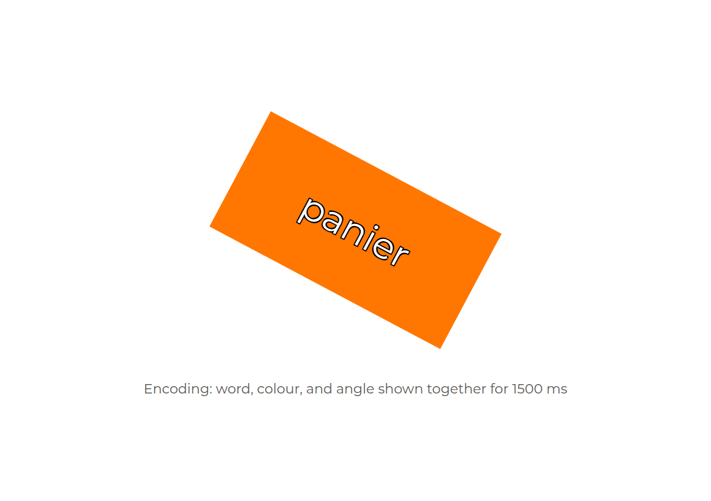
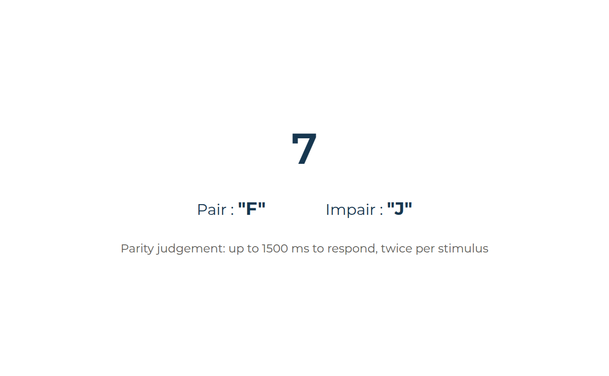
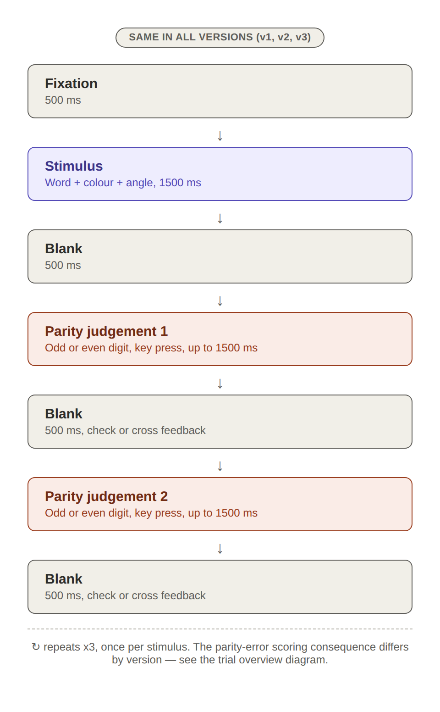
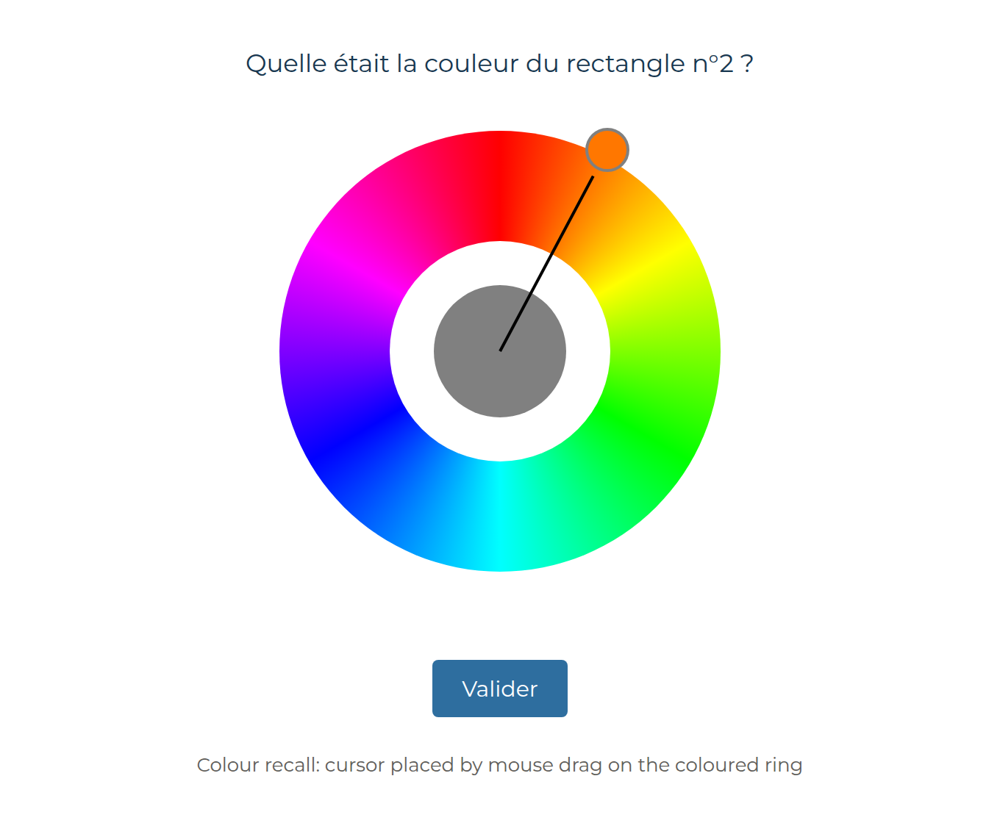
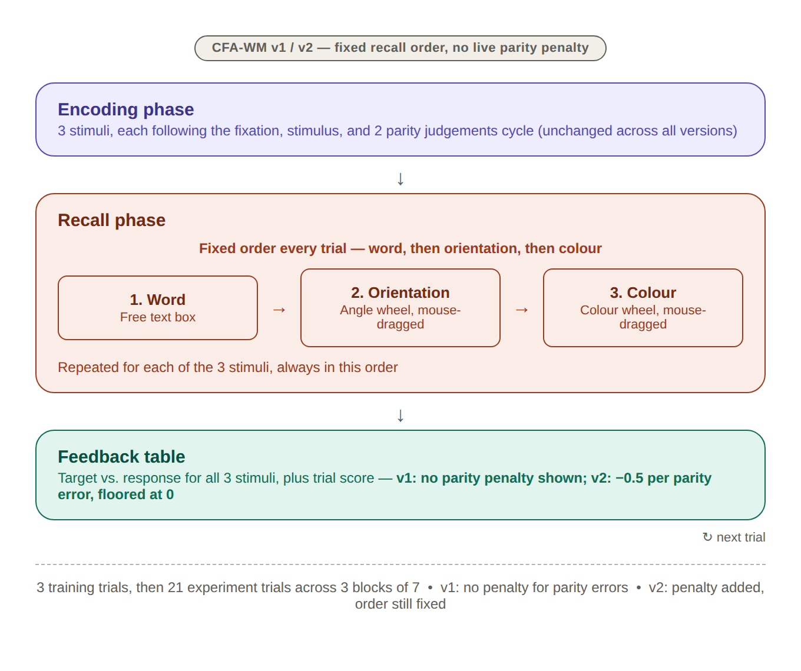
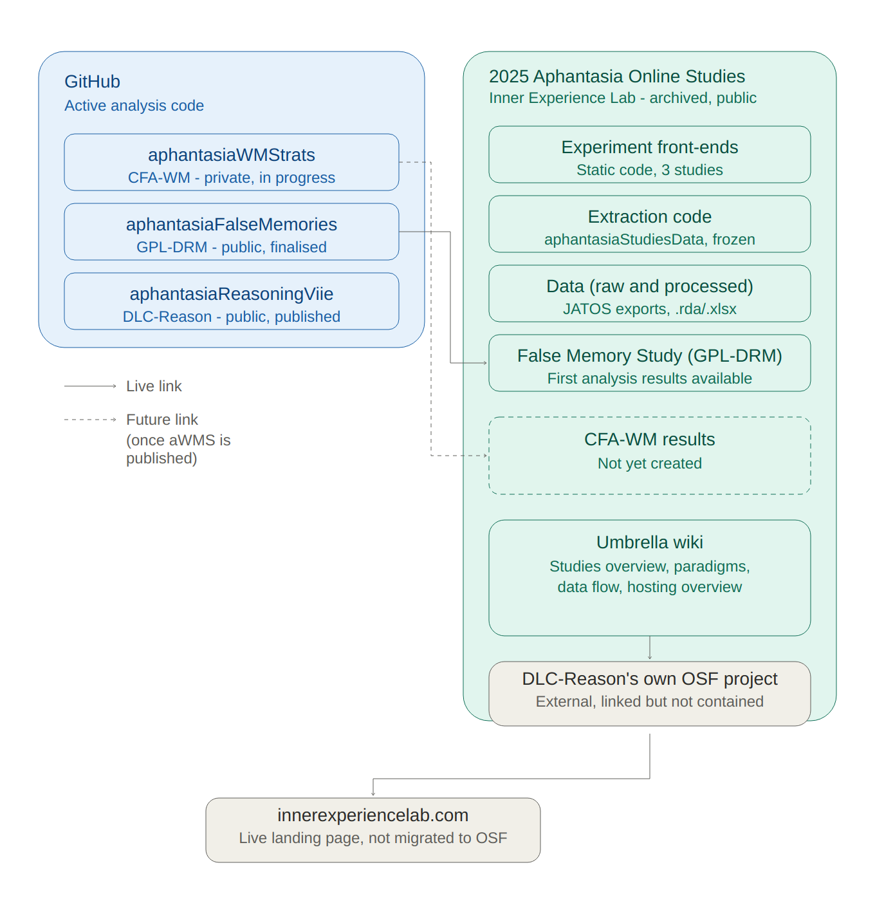
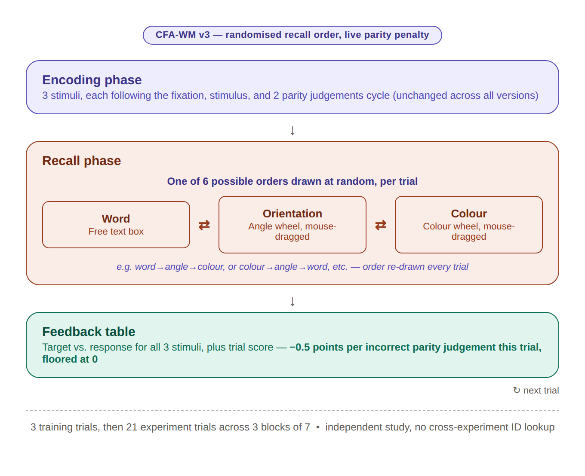
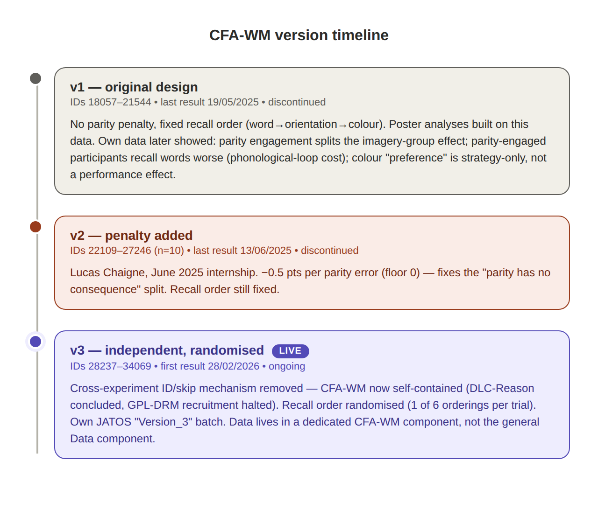

```{r setup, include = FALSE}
knitr::opts_chunk$set(
  echo = FALSE,
  collapse = TRUE, 
  comment = "#>", 
  fig.width = 8, 
  fig.height = 5,
  warning = FALSE, 
  message = FALSE,
  error = FALSE
)
library(aphantasiaWMStrats)
library(ggplot2)
theme_set(theme_minimal(base_size = 16))
pct <- function(x) sprintf("%.0f%%", 100 * x)

block_trials <- all_data |>
  dplyr::filter(grepl("^expe_block", expe_phase))
```

Underneath the WM-FTT's aim of studying individual differences in mental
representation is a narrower question: does an original paradigm actually
measure what it was built to measure? The task ran in three versions. The
differences between them are not incidental fixes. Each version exists because
the previous one's own data showed a specific way the design was undermining its
own purpose.

This page tells that story, and shows the task as participants met it.

## 1. The question the task was built for {#task-question}

Aphantasic individuals perform about as well as typical imagers on visual
working memory tasks, despite reporting no voluntary visual imagery. Asked how,
they say they compensate: verbal labels, spatial relations, anything but
pictures.

That answer is not the thing under suspicion. A strategy is what a person takes
themselves to be doing, and no behavioural pattern can overrule their own
account of it. The difficulty is narrower: **raw per-feature accuracy cannot
tell a deliberate choice from an inability**. A low colour score is equally
consistent with being worse at colour and with having given colour up to protect
something else, and those are different claims about the same number.

WM-FTT is built to separate them, and to offer the reports something to converge
with. Every stimulus carries three features at once, and scoring gives partial
credit for each, so a participant who divides effort unevenly across features
may leave a trace in the pattern of their three scores rather than in any one of
them. Its purpose is to try to relate the response to "which strategy do you
use" with the behavioural allocation of "where did the effort go".

## 2. What a trial looks like {#task-trial}

Each stimulus is a coloured rectangle containing a written word, shown at some
rotation. Three independent features to remember, in one object: a **word**
(verbal), an **orientation** (spatial), a **colour** (visual).

```{r stimulus, fig.alt="The WM-FTT stimulus: a coloured, rotated rectangle containing a word."}

```

Between stimuli, participants judge whether a digit is odd or even. This is a
distractor, there to stop simple visual rehearsal carrying a stimulus across the
gap and to force active encoding.

```{r parity, fig.alt="The parity judgement screen: is this digit odd or even?"}

```

One full encoding cycle, fixation through stimulus through the parity judgements
that follow it, repeats once per stimulus:

```{r encoding, fig.alt="One encoding cycle: fixation, stimulus, then two parity judgements."}

```

After all three stimuli, participants recall each item's word by typing it, its
orientation by rotating an on-screen rectangle, and its colour by clicking a
point on a colour wheel.

```{r colourwheel, fig.alt="The colour recall screen: a colour wheel to click on."}

```

Scoring is feature by feature with partial credit, and participants are told to
aim for the highest score. That instruction is the manipulation. A
points-per-feature incentive is what is meant to turn uniform effort into a
suboptimal strategy and make the trade-off worth measuring.

Twenty-one experimental trials in three blocks of seven, preceded by three
training trials. **Each trial presents three items**, and each item is a word
shown at an orientation in a colour, so a participant sees 63 items in all.
Those two units are used strictly throughout this report: a *trial* is one
encode-distract-recall cycle and there are 21 of them; an *item* is one of the
three objects inside a trial and there are 63. The task draws on 63 distinct
colours and 63 distinct angles so that no value repeats.

## 3. v1: what the first version's own data exposed {#task-v1}

The first version ran as designed: no penalty on the parity task, and a fixed
recall order, word then orientation then colour, on every trial.

```{r trial-v1v2, fig.alt="Full trial structure for v1 and v2: fixed recall order, no live parity penalty in v1."}

```

Two problems surfaced, both visible in the data rather than anticipated.

**The parity task had no consequence, and the sample split on that.** Because
parity performance did not affect the score participants saw, a large part of
the sample worked this out and stopped doing it properly, treating it as free
time to rehearse instead. The [task engagement](engagement.html) page puts
numbers on it: 25 of 88 answered no parity probe at all, and 39 of 88 answered
fewer than half. Not one participant answered every probe. That the penalty was
genuinely absent is checkable directly:

```{r parity-check, echo = TRUE}
block_trials |>
  dplyr::filter(version == "v1") |>
  dplyr::summarise(
    feature_scores_summed = sum(feedback_score_word) +
      sum(feedback_score_angle) + sum(feedback_score_color),
    trial_score_shown = dplyr::first(feedback_trial_score),
    .by = c(id, expe_phase, trial_number)
  ) |>
  dplyr::summarise(
    trials = dplyr::n(),
    trials_where_they_match = sum(
      abs(feature_scores_summed - trial_score_shown) < 1e-9)
  ) |>
  knitr::kable(caption = "v1: the trial score is exactly the sum of the three feature scores")
```

Every trial. No deduction was ever applied.

The consequence was **not** that the distractor did nothing. It was that it was
not experienced uniformly: some participants carried a dual-task load throughout
and others carried none, and nothing in the design records which (besides raw
parity engagement). That is a problem for any group comparison drawn from v1,
because the two "parity subgroups" were doing materially different tasks. The
[task engagement](engagement.html) page shows that abandoning parity is not a
proxy for disengaging from the task as a whole, which is why v2 added the
penalty.

## 4. v2: fixing the incentive, not the order {#task-v2}

A June 2025 internship added the **parity penalty**: each incorrect judgement
subtracts 0.5 points from the trial's running score, floored at zero so parity
errors alone cannot make a trial negative. Recall order stayed fixed.

v2 is a partial fix. It closes the gap between parity-engaged and disengaged
participants, but its own sample is small.

## 5. Why v2 stopped {#task-v2-stopped}

Two things happened that had nothing to do with WM-FTT. A sibling reasoning
study concluded, and a false-memory study's recruitment was halted after its own
analysis surfaced problems. All three had shared a single online entry point and
a common pseudonymisation mechanism that let a participant who did more than one
study skip repeating shared questionnaires. WM-FTT's continued operation
depended on infrastructure tied to studies that were no longer running.

```{r hosting, fig.alt="How the lab's online studies were hosted and shared infrastructure."}

```

So the task became independent: the cross-experiment lookup was removed, and
data collection became self-contained.

## 6. v3: independent, randomised, live {#task-v3}

v3 carries the parity penalty over from v2 and adds **response-order
randomisation**: one of the six possible orderings of word, orientation and
colour is drawn per trial. This is added to the parity incentive fix, which v2
already addressed. It removes recall order as a fixed structural feature, and
with it a class of confounds that any order-related finding would otherwise have
to rule out.

```{r trial-v3, fig.alt="Full trial structure for v3: randomised recall order and a live parity penalty."}

```

```{r timeline, fig.alt="Timeline of the three task versions and what changed between them."}

```

## 7. Where that leaves the three versions {#task-versions}

```{r versions, echo = TRUE}
block_trials |>
  dplyr::distinct(id, version, vviq_group_2) |>
  dplyr::count(version, vviq_group_2) |>
  tidyr::pivot_wider(names_from = vviq_group_2, values_from = n,
                     values_fill = 0) |>
  knitr::kable(caption = "Participants per version and imagery group")
```

|   | v1 | v2 | v3 |
|--------------------|--------------------|--------------------|--------------------|
| Parity penalty | none | −0.5 per error, floored at 0 | −0.5 per error, floored at 0 |
| Recall order | fixed | fixed | randomised per trial |
| Cross-study ID lookup | active | active | removed |
| Status | discontinued | discontinued | live |

The versions are not a single pooled sample. Both changes have identified,
data-supported reasons to affect performance and strategy measures, so version
has to be treated as a structural feature of the design rather than a nuisance
covariate.

For the time being (as of 2026-09-03), **v1 is the primary analysis sample**,
and v2 and v3 are described rather than modelled. v1 is the only version with a
usable imagery-group split, and pooling the three actively produced a false
result: an apparent association between non-response and imagery vividness that
dissolves once version is accounted for, because v3 is simultaneously
aphantasia-heavy and the version where participants answered least.

```{r pooling-trap, echo = TRUE}
non_response <- block_trials |>
  dplyr::mutate(participant = paste(id, version, sep = "_")) |>
  dplyr::summarise(
    non_response = 1 - mean(c(responded_angle, responded_color)),
    vviq = dplyr::first(vviq_total_score),
    .by = c(participant, version)
  )

tibble::tibble(
  sample = c("All versions pooled", "v1 alone"),
  rho = c(
    stats::cor(non_response$non_response, non_response$vviq,
               method = "spearman", use = "complete.obs"),
    with(dplyr::filter(non_response, version == "v1"),
         stats::cor(non_response, vviq, method = "spearman",
                    use = "complete.obs"))
  )
) |>
  knitr::kable(digits = 3,
               caption = "Non-response against imagery vividness, pooled and within v1")
```

The pooled figure looks like a finding. It is actually an artefact of mixing
three samples that differ in both composition and behaviour.

## 8. What the task achieved, and what it did not {#task-verdict}

The design goal was a three-way trade-off between word, orientation and colour.
What it produced is a two-way one. Word recall turns out to be too easy to
compete: participants can max it cheaply and then divide what is left between
the two non-verbal features.

```{r ceiling, echo = TRUE}
block_trials |>
  dplyr::filter(version == "v1") |>
  dplyr::summarise(
    `Word` = mean(score_word[responded_word] == 1),
    `Orientation` = mean(score_angle[responded_angle] == 1),
    `Colour` = mean(score_color[responded_color] == 1)
  ) |>
  tidyr::pivot_longer(dplyr::everything(), names_to = "Feature",
                      values_to = "Share of answered items at ceiling") |>
  knitr::kable(digits = 3, caption = "Exact matches among answered items, v1")
```

Nine in ten answered word items are exact matches. The consequence runs through
the whole project: **word barely discriminates between participants**, so the
verbal arm of the compositional analysis rests on the least informative of the
three measures. The [task validity](task-validity.html) page puts a number on
that with split-half reliability, and the [scoring](scoring.html) page works
through what it does and does not permit.

This is the kind of thing a paradigm can only learn from its own data, which is
also the theme of the two version changes that came before it. A fourth version
would need to make the word feature harder, distinguish a deliberate
non-response from an untouched widget, and vary the points per feature so that
strategic skipping can be told apart from an absent representation.

--------------------------------------------------------------------------------

**Continuing through the Extended Online Report:** this is the first page of the
report. To keep reading in order, continue to [the
participants](participants.html) next. Or skip ahead to [the
analysis](analysis-strategy.html), which explains what the modelling pages do
and why.

--------------------------------------------------------------------------------

```{r}
#| label: session_info
#| echo: false

sessioninfo::session_info()
```
